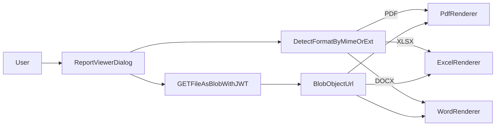

# План реализации онлайн-просмотра Word/Excel/PDF

## Цель

Сделать просмотр отчетов в браузере без обязательного скачивания и без установки офисного ПО, сохранив текущую модель авторизации и существующие API.

## Текущая база (что уже можно переиспользовать)

- Backend уже генерирует Excel и PDF:
  - [backend/services/services_export.py](backend/services/services_export.py)
  - [backend/services/services_config_integrity_report.py](backend/services/services_config_integrity_report.py)
- Backend уже отдает файлы (включая каталог ИС):
  - [backend/api/api_export.py](backend/api/api_export.py)
  - [backend/api/api_config_integrity.py](backend/api/api_config_integrity.py)
  - [backend/api/api_is_catalog.py](backend/api/api_is_catalog.py)
- Frontend уже умеет получать blob, но везде в основном download-flow:
  - [frontend/src/pages/IsCatalogPage.jsx](frontend/src/pages/IsCatalogPage.jsx)
  - [frontend/src/pages/ProjectResultsPage/useProjectResults.js](frontend/src/pages/ProjectResultsPage/useProjectResults.js)
  - [frontend/src/pages/ConfigIntegrityPage.jsx](frontend/src/pages/ConfigIntegrityPage.jsx)
- Есть заготовки для UI:
  - [frontend/src/components/IsCatalogFileIcons.jsx](frontend/src/components/IsCatalogFileIcons.jsx)
  - [frontend/src/components/ui/dialog](frontend/src/components/ui/dialog)

## Архитектурный подход (единый слой просмотра)

- Создать общий frontend-компонент `ReportViewerDialog` с переключением рендера по MIME/расширению.
- Добавить backend-эндпоинты/режимы `inline` (где уместно), чтобы браузер не принуждал скачивание.
- Для тяжелых форматов (Word/Excel) использовать рендер в HTML в браузере (клиентские библиотеки) с graceful fallback на download.

## По форматам

### PDF

**Технический подход (приоритет №1):**

- Вариант A (базовый, рекомендуемый): `blob` + `URL.createObjectURL` + `<iframe>/<object>` в `Dialog`.
- Вариант B (расширенный): `pdf.js`/`react-pdf` для пагинации, zoom, поиск.
- Источники данных: существующие endpoints из [backend/api/api_config_integrity.py](backend/api/api_config_integrity.py), [backend/api/api_is_catalog.py](backend/api/api_is_catalog.py).

**Плюсы:**

- Минимальные изменения backend.
- Быстрый time-to-value.
- Хорошая совместимость с браузерами.

**Минусы:**

- Базовый iframe-вариант дает ограниченный UX (без продвинутого поиска/аннотаций).
- Для очень больших PDF может быть заметная задержка.

**Сложность:**

- Вариант A: ~8-14 часов.
- Вариант B: ~16-28 часов.

**Ограничения:**

- В старых/ограниченных браузерах встроенный PDF-viewer может работать нестабильно.
- Нужна аккуратная очистка object URL, чтобы не копить память.

### Excel (XLSX)

**Технический подход:**

- Вариант A (рекомендуемый): парсинг в браузере библиотекой `xlsx` (SheetJS), отображение выбранного листа в virtualized table.
- Вариант B: серверная конвертация XLSX→HTML (для preview-only endpoint), клиент рендерит готовый HTML.
- Источник: существующий экспорт из [backend/api/api_export.py](backend/api/api_export.py) и файлы из [backend/api/api_is_catalog.py](backend/api/api_is_catalog.py).

**Плюсы:**

- Без внешних облачных сервисов.
- Полный контроль доступа (JWT, ваш backend).
- Можно показывать только превью (например, первые N строк) для скорости.

**Минусы:**

- Неполная поддержка сложного форматирования, формул, merged-cells в preview.
- Большие таблицы требуют оптимизации рендера.

**Сложность:**

- Клиентский preview (SheetJS + table): ~20-36 часов.
- Серверный XLSX→HTML preview endpoint: ~24-40 часов.

**Ограничения:**

- Preview не будет 1-в-1 как в Excel desktop.
- Для больших файлов нужен лимит/пагинация/виртуализация.

### Word (DOCX)

**Технический подход:**

- Вариант A (рекомендуемый): клиентский рендер DOCX→HTML через `mammoth` или `docx-preview`.
- Вариант B: серверная конвертация DOCX→HTML/PDF (LibreOffice/unoconv в контейнере) и показ результата.
- Источник: файлы из [backend/api/api_is_catalog.py](backend/api/api_is_catalog.py).

**Плюсы:**

- Можно реализовать без внешних SaaS и без Office на клиенте.
- Быстрый MVP через клиентский HTML-рендер.

**Минусы:**

- Сложные DOCX (колонтитулы, сложные таблицы, трекинг изменений, embedded-объекты) отображаются неидеально.
- Серверная конвертация тяжелее в эксплуатации (доп. зависимости, ресурсы).

**Сложность:**

- Клиентский DOCX→HTML: ~20-34 часа.
- Серверная DOCX-конверсия: ~40-72 часа.

**Ограничения:**

- Качество рендера зависит от структуры документа.
- Для legacy `.doc` почти всегда потребуется server-side conversion.

## Безопасность и доступ

- Сохранить текущий JWT-подход из [frontend/src/config/api.js](frontend/src/config/api.js): загружать файл через авторизованный `api.get(..., { responseType: 'blob' })`, не выдавать публичные URL.
- Если нужен inline endpoint, добавить короткоживущий signed token (TTL 1-5 мин) и scope по `file_id/report_id`.
- Ограничить размер preview и добавить аудит открытия документа.

## Этапы внедрения

1. **MVP PDF viewer**
  - Новый `ReportViewerDialog` и интеграция в страницы с PDF-кнопками.
  - Поддержка fallback «Скачать».
2. **Excel preview**
  - Подключить SheetJS, показывать листы + ограничение строк для first paint.
3. **Word preview (DOCX)**
  - Подключить `mammoth`/`docx-preview`, отрисовка в sanitized container.
4. **Унификация и hardening**
  - Единая точка входа `openPreview(fileMeta)`.
  - Метрики, обработка ошибок, лимиты, тесты.

## Оценка суммарно

- Базовый production-ready контур (PDF + Excel + DOCX preview + fallback download): **~56-98 часов**.
- Расширенный контур (улучшенный UX PDF, серверные конверсии DOCX/XLSX, кеширование): **~110-180 часов**.

## Приоритизация (с чего начать)

1. **PDF (первый релиз)** — самая низкая сложность и быстрый эффект для пользователей.
2. **Excel** — высокий бизнес-эффект, уже есть экспортная логика в проекте.
3. **Word DOCX** — после Excel, так как выше риск несовпадения форматирования.
4. **Server-side conversion для сложных документов** — только при подтвержденной потребности и после сбора обратной связи по MVP.

